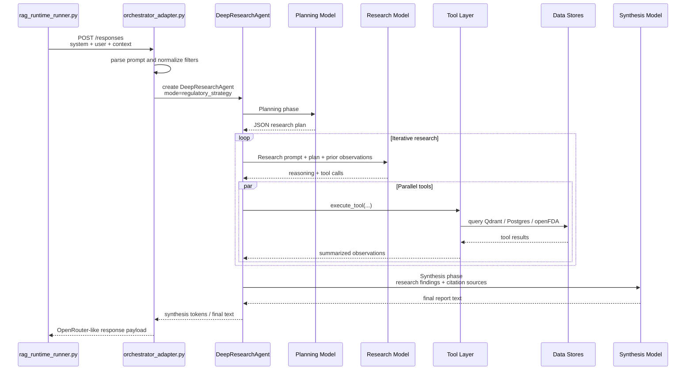

# Inquisito Regulatory Strategy Mode Architecture

## Overview

This document describes the runtime path we evaluate for Inquisito in `regulatory_strategy` mode.

- Evaluated top-level agent: `DeepResearchAgent`
- Fixed mode: `regulatory_strategy`
- Entrypoint for eval: `experiments/Inquisito-Infra/orchestrator_adapter.py`
- External runner: `orchestrator/rag_runtime_runner.py`

The important architectural point is that the eval adapter does **not** evaluate a separate side-agent. It evaluates the single top-level deep research agent, which internally performs planning, iterative tool use, synthesis, and follow-up generation.

## Component Diagram

```mermaid
flowchart TD
    A[rag_runtime_runner.py] --> B[Inquisito Adapter<br/>/responses]
    B --> C[resolve_request<br/>parse prompt + context JSON]
    C --> D[InquisitoRunner]
    D --> E[DeepResearchAgent<br/>research_mode=regulatory_strategy]

    E --> F[Phase 1<br/>Planning LLM]
    E --> G[Phase 2<br/>Research ReAct Loop]
    E --> H[Phase 3<br/>Synthesis LLM]
    E --> I[Phase 4<br/>Follow-ups + Sources]

    G --> J[Tool Dispatcher<br/>execute_tool(...)]

    J --> K[Device Retrieval Tools<br/>semantic_search<br/>get_device_details<br/>compare_devices<br/>search_by_product_code<br/>search_by_regulation]
    J --> L[Strategy Tools<br/>get_regulatory_reference_data<br/>search_guidance_for_strategy<br/>search_consensus_standards_for_strategy<br/>fetch_postmarket_signals]
    J --> M[Document Tool<br/>analyze_document]

    K --> N[Qdrant<br/>510k device collections]
    K --> O[Postgres<br/>device metadata]

    L --> P[Postgres<br/>fees/timelines]
    L --> Q[Qdrant<br/>guidance_documents]
    L --> R[Qdrant<br/>fda_consensus_standards]
    L --> S[openFDA live API<br/>postmarket signals]

    F --> T[OpenRouter / model routing]
    G --> T
    H --> T
    I --> T
    M --> T
```

## Runtime Flow



## Phase Details

### Phase 0: Document Briefing

This phase only runs if raw uploaded-document text is passed in. In the current eval adapter path, `document_context` is `None`, so this phase is effectively skipped.

### Phase 1: Planning

The planning model uses Inquisito's built-in `PLANNING_REGULATORY_STRATEGY_PROMPT` to emit a structured JSON plan:

- understanding
- key_concepts
- research_steps
- expected_outcome

That plan is then injected into the later research prompt as an execution checklist.

### Phase 2: Research ReAct Loop

This is the main workhorse:

- the model reasons about what to do next
- it emits tool calls
- tools run in parallel when possible
- compact observations are fed back to the model
- sources and tool results accumulate over multiple iterations

In `regulatory_strategy` mode:

- the agent allows more iterations than predicate mode
- the agent allows more tool calls per iteration
- early completion on source-count alone is disabled
- the tool surface expands beyond device search into fees, guidances, standards, and postmarket signals

### Phase 3: Synthesis

The synthesis model uses the built-in `SYNTHESIS_REGULATORY_STRATEGY_PROMPT` and receives:

- original query
- research findings built from tool outputs
- numbered sources for citation

If the report is cut off, the agent automatically issues continuation calls until the report completes or the continuation limit is reached.

### Phase 4: Follow-ups and Sources

After synthesis, the agent emits:

- follow-up questions
- strategy resources such as guidance and standards
- numbered sources aligned to the final report

## Prompt Surfaces

The key distinction is between **fixed internal prompts** and the **externally tuned eval prompt**.

### Fixed Internal Prompts

These remain Inquisito-owned in the current eval setup:

- `PLANNING_REGULATORY_STRATEGY_PROMPT`
- `SYNTHESIS_REGULATORY_STRATEGY_PROMPT`

So planning behavior and final-report formatting are still largely anchored to Inquisito's original design.

### Externally Tuned Prompt

The eval runner tunes the **Phase 2 research prompt**:

- `runs/prompts/inquisito_regulatory_strategy_system.txt`
  - passed by the adapter as `client_system_prompt`
  - replaces the built-in `RESEARCH_REGULATORY_STRATEGY_PROMPT`
- `runs/prompts/inquisito_regulatory_strategy_user.txt`
  - rendered by the runner
  - parsed by the adapter
  - passed into the agent as `research_request_override`
  - becomes the top `Research Request: ...` line in the research-phase user prompt

### Structured Context

The adapter also extracts structured context fields such as:

- `product_code`
- `regulation_number`
- `year_from`
- `year_to`

These are passed as default tool filters, not echoed back into the prompt in the current eval path.

## What We Are Actually Tuning

For this eval path, the tuned behavior is:

- how the research model decides which tools to call
- how aggressively it executes the approved research plan
- how it balances predicate search with guidance, standards, fees, and postmarket retrieval

What we are **not** currently tuning:

- the planning prompt
- the synthesis prompt
- the underlying tool implementations
- the retrieval indexes or database contents

## Summary

The Inquisito `regulatory_strategy` architecture is best understood as:

1. a fixed planning stage
2. a tunable research/tool-use stage
3. a fixed synthesis stage
4. grounded retrieval across Postgres, Qdrant, and selected live openFDA calls

That is the exact runtime shape the eval adapter exposes today.
